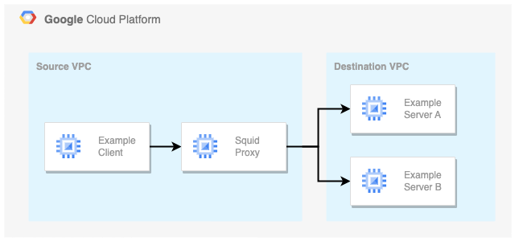

# Use Squid Proxy To Connect Two VPCs

There are tons of ways to [connect VPCs](https://xebia.com/blog/how-to-setup-network-connectivity-between-vpcs-in-google-cloud/) in Google Cloud. This example uses a Squid Proxy VM to allow Source VPC Clients to access resources in the Destination VPC.



> Read the associated blog post: [How To Use Squid Proxy To Connect Two VPCs](https://xebia.com/blog/how-to-use-squid-proxy-to-connect-two-vpcs/).

## Deployment

Use Terraform to deploy the example setup.

1. Set the required Terraform variables

    [variables.tf](terraform/variables.tf)

2. Deploy the example infrastructure

    ```bash
    cd terraform
    terraform init
    terraform apply
    ```

3. Try it for yourself

    Log in to the client VM:

    ```bash
    gcloud compute ssh client --tunnel-through-iap --project <project_id>
    ```

    Invoke a service in the destination VPC:

    ```bash
    curl -x http://proxy.xebia:3128 http://example-server.xebia/
    ```

    Invoke an internet url via the proxy:

    ```bash
    curl -x http://proxy.xebia:3128 https://www.google.com/
    ```

## Clean up

Use Terraform to destroy the example setup.

1. Set the required Terraform variables

    [variables.tf](terraform/variables.tf)

2. Destroy the example infrastructure

    ```bash
    cd terraform
    terraform init
    terraform destroy
    ```